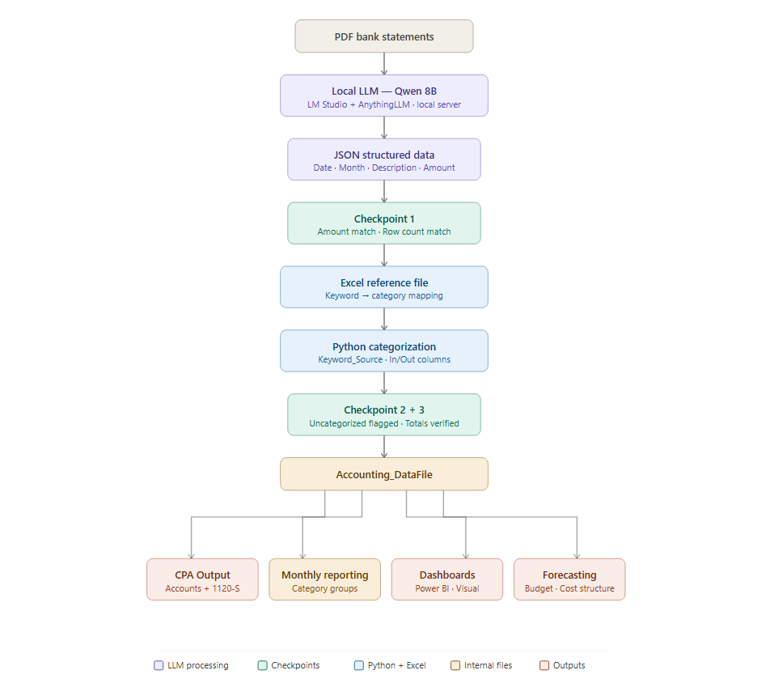

# XTMA — Financial Management System for a US-Based S-Corp

## Overview

End-to-end financial management system built from scratch for a real 
US-based S-Corp operating in service and merchandise (~$250K annual 
revenue). The business had no financial infrastructure before this 
project.

Built independently as a self-initiated project alongside 
full-time studies — no prior development background.

This system covers the full financial workflow: document management, 
cash accounting automation, internal reporting, CPA-ready output, 
and visual dashboards.

All data is stored and shared securely via Proton Drive 
(end-to-end encrypted), accessible in real time by the business owner.

→ See full roadmap and planned improvements : [ROADMAP.md](ROADMAP.md)
## Workflow overview



## Scope

### 1. Document Management
Centralized and structured repository of all company documents:
- Bank statements (ECB)
- Invoices and receipts
- Contracts and accreditations
- Corporate documents (statutes, incorporation)
- Tax declarations and past filings
- Employee forms (W-2, payroll-related documents)
- Internal working files and historical reports

All documents organized, named consistently, and securely stored 
on Proton Drive with shared access for the business owner.


### 2. Cash Accounting Automation

The core automated pipeline transforms raw PDF bank statements 
into structured, verified financial data.


#### Step 1 — PDF to JSON (Local LLM)
Bank statements processed by a local LLM (Qwen 8B) hosted via 
LM Studio, accessible via AnythingLLM on the local network.

The LLM structures each transaction into standardized JSON:
```json
{
  "Date": "",
  "Month": "",
  "Description": "",
  "Amount": "",
  "Account": "",
  "Inflow/Outflow": ""
}
```

**Why local?** All sensitive financial data stays on-premise. 
Nothing sent to external APIs.

Processing time: ~10–15 minutes per statement.
Uncategorized rate: ~6% (flagged automatically for manual review).

#### Step 2 — First Checkpoint
- Total amount in JSON = Total on bank statement ✓
- Row count in JSON = Row count on bank statement ✓

#### Step 3 — Excel Reference File
Categorization driven by a dedicated Excel reference file — 
not hardcoded lists in the script.

Structure: each column header = one category. 
Each value = a keyword to match in the transaction description.

Advantages over hardcoded Python lists:
- Add or modify keywords without touching code
- Conditional formatting flags duplicate keywords instantly
- Readable and auditable at 100+ terms
- Left-to-right column order manages keyword priority conflicts

#### Step 4 — Python Categorization
Script cross-references each transaction against the reference 
file and adds:
- `Keyword_Source` — keyword that triggered the match
- `In/Out` — inflow or outflow

→ [`src/categorization.py`](src/categorization.py)

#### Step 5 — Final Checkpoints
- Uncategorized transactions flagged automatically
- Total amount verified
- Row count verified

#### Step 6 — Excel Fusion
Monthly output files are merged into a single master file
for annual consolidation into the Accounting_DataFile.

→ [`src/fusion.py`](src/fusion.py)

### 3. Accounting_DataFile

Master internal file consolidating all transactions for a given year.

**Structure:**
Date | Month | Description | Amount | Account | Category | 
Keyword_Source | In/Out

**Features:**
- Two slicers: Category and Month
- Full granularity — every transaction individually traceable
- Final verification checkpoint before reporting
- Contextual review of ambiguous transactions

This file is the single source of truth for all downstream outputs.


### 4. Accounting_Monthly_Reporting

Internal file built from the DataFile. Standardized template 
consistent across all years.

Organizes transactions by category groups:
- Income
- Operating Expenses
- Variable Costs
- Travel Expenses
- Non-Business Related Expenses

Month-by-month breakdown across the full year with first-level 
insights: most profitable month, highest expense month per category.


### 5. CPA Output — Accounts & Mapping

External file produced for the CPA. Maps internal categories 
to standard US chart of accounts used in the Form 1120-S filing.

Example: Software, Freight and Shipping → Utilities

Built with data coming from the 2025 tax declaration — 
the exact structure the CPA already works with.

*Note: automatic mapping from previous year's accounts 
is a planned improvement — see ROADMAP.*


### 6. Dashboards & Visual Reporting

*(In progress)*

Power BI dashboards providing visual cash flow analysis 
across all categories, integrating bank data and additional 
sources (Stripe, etc.).

Current status: first versions produced, refinement in progress 
based on business owner requirements.


### 7. Management Reporting & Forecasting

*(In progress)*

- Cost structure analysis across 3 years of data
- Annual budget
- 6-month cash flow forecast

*See ROADMAP for current status.*


## Results

| Metric | Before | After |
|--------|--------|-------|
| Financial infrastructure | None | Complete system |
| Processing time (full year) | 3–4 weeks | 8–15 hours |
| Transactions per year | ~1,800 | ~1,800 |
| Uncategorized rate | Unknown | ~6% flagged automatically |
| Checkpoints | None | 3 automated verification steps |
| Document management | Scattered | Centralized, structured, encrypted |
| CPA-ready output | Manual reformatting | Direct mapping to chart of accounts |
| Cash flow visibility | None | Monthly reporting + dashboards |


## Tech Stack

| Tool | Role |
|------|------|
| Qwen 8B (local) | PDF to JSON structuring |
| LM Studio | Local LLM hosting |
| AnythingLLM | Local LLM interface |
| Python | Categorization script |
| Excel + Power Query | Reference file, DataFile, reporting |
| Power BI | Visual dashboards |
| Proton Drive | Encrypted storage and sharing |


## How This Evolved

**V1 — Pure Python**
Keyword lists hardcoded directly in the script.

Problems:
- Inflexible — adding keywords required editing code
- No duplicate detection
- No checkpoints
- Unreadable at 100+ terms
- Difficult to audit without strong Python knowledge

**V2 — Current System**
Keyword management moved to a dedicated Excel reference file.
Local LLM replaces manual PDF parsing.
Three automated checkpoints added.
Full document infrastructure built on Proton Drive.


## Limitations & Open Questions

- LLM processing: ~10–15 min per statement (optimization needed)
- ~6% uncategorized transactions require manual review
- 24 manual runs per year (automation planned)
- Dashboard refinement in progress
- Automatic CPA mapping not yet implemented

*See ROADMAP for planned improvements.*


## Data & Privacy

Built on real financial data from a US-based S-Corp.
All raw data excluded from this repository (.gitignore).
Only anonymized examples and code logic shared publicly.
Sensitive documents stored exclusively on encrypted Proton Drive.


## Status

- [DONE]  Document management infrastructure complete
- [DONE]  Full automation pipeline operational
- [DONE]  3 years of data processed and verified
- [DONE]  CPA output produced and validated
- [IN PROGRESS]  Dashboards — refinement in progress
- [IN PROGRESS]  Forecasting and budget — in progress
- [IN PROGRESS]  Automatic CPA mapping — planned
- [IN PROGRESS]  LLM speed optimization — planned
